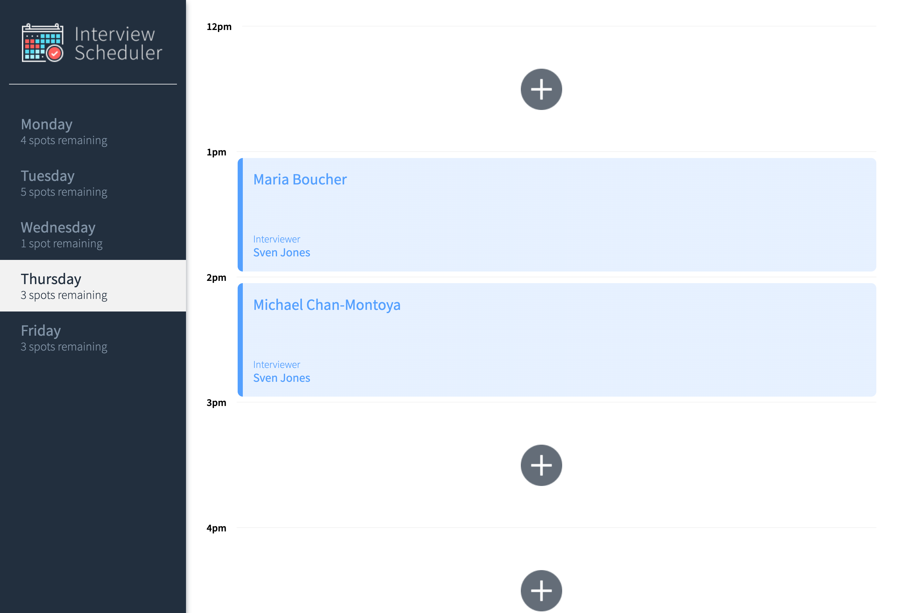
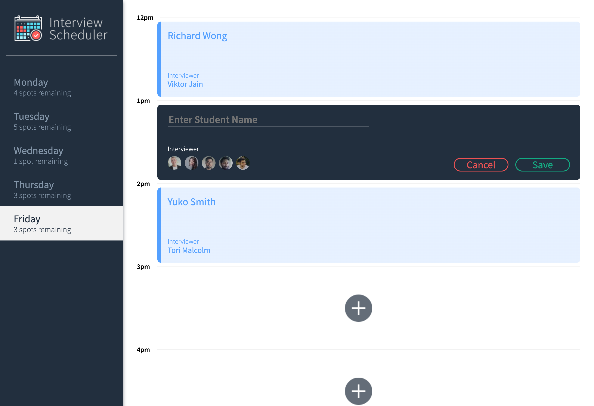

# Interview Scheduler

## Purpose

This project was built as a part of my learnings at [Lighthouse Labs](https://www.lighthouselabs.ca).

## Final Product

View of Thursday's Interviews



View of Adding an Interview



## Features
- Custom Hook to keep track of the mode that users are in as they do things like create a new appointment, delete an appointment, etc.
- Built with Test Driven Development approach


## Setup

Install dependencies with `npm install`.

## Running Webpack Development Server

```sh
npm start
```

## Running Jest Test Framework

```sh
npm test
```